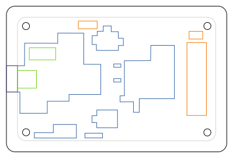

# Bus Blaster Case

This is a sandwich-style case for the Bus Blaster v4.1a
intended to be cut with a laser cutter using 2mm acrylic
glass sheets.

The case consists of 2 layers below the PCB and 4 layers
above the PCB, that are hold together with four M3 screws
(ca. 15mm length) and a (domed cap) nut. You should cut
the following colors for the individual layers (gray line
is the PCB edge and only provided for reference):

Layer 0 (bottom):
 * black

Layer 1 (below PCB):
 * black
 * orange

Layer 2 (above PCB):
 * black
 * orange
 * blue
 * violet

Layer 3:
 * black
 * orange
 * green
 * violet

Layer 4:
 * black
 * orange
 * violet

Layer 5:
 * black
 * orange
